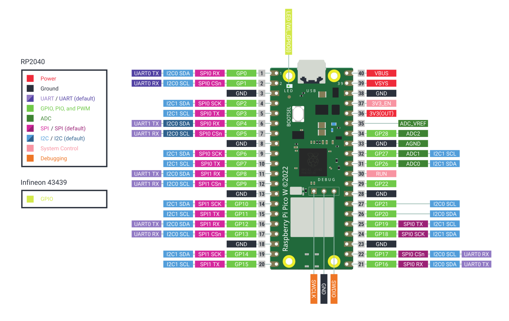

Link do vídeo no drive: https://drive.google.com/file/d/1Soupo5cv8l8bHnsSBXVKkjptQ12IvmSY/view?usp=sharing

# atividade-godoi-semana7-m

## Documentação do Código com Sensor BME280

## Modelo Ideal:

O modelo acima foi utilizada para ligar as portas para funcionamento do circuito com a comunicação I2C.

## Modelo Real:

A construção abaixo foi a apresentação final apresentada no vídeo e mais detalhadamente explicada abaixo.

## Descrição Geral

Este script Python é destinado a microcontroladores que suportam MicroPython, como o Raspberry Pi Pico, e utiliza o sensor BME280 para medir a temperatura e a pressão atmosférica. Os dados coletados são exibidos no console a cada 4 segundos.

## Comunicação I2C e Serial com Raspberry Pi Pico

### Comunicação I2C (Raspberry Pi Pico e BME280)
- **I2C**: Protocolo de comunicação serial para dispositivos de baixa velocidade.
- **Configuração**: Utiliza dois pinos, SDA (Dados) e SCL (Relógio), no Raspberry Pi Pico.
- **Conexão com BME280**: Sensor conectado via I2C, usando pinos específicos para SDA e SCL.
- **Operação**: O Raspberry Pi Pico inicia a comunicação, especifica o endereço do BME280, e transmite ou recebe dados.

### Comunicação Serial (Raspberry Pi Pico e PC)
- **Serial**: Comunicação ponto a ponto entre microcontrolador e PC.
- **Porta Serial Virtual**: Raspberry Pi Pico cria uma porta COM virtual via USB.
- **Implementação**: Utiliza a biblioteca `machine.UART` no Pico para configurar a comunicação.
- **Conexão e Uso**: Pico conectado ao PC por USB, dados transmitidos através da porta COM, facilitando programação e monitoramento.

## Requisitos e Dependências:

- Microcontrolador compatível com MicroPython (ex.: Raspberry Pi Pico).

- Sensor BME280.
- Biblioteca BME280 específica para a interação com o sensor BME280.
- Módulo machine para controle de hardware do microcontrolador.

Módulo time para funções relacionadas ao tempo (como sleep).

## Configuração do Hardware

- Pinagem: O sensor BME280 é conectado ao microcontrolador via I2C. Os pinos SDA e SCL são definidos como 20 e 21, respectivamente, mas podem variar dependendo do microcontrolador utilizado.
  I2C: Uma instância do I2C é criada com a frequência de - 400kHz.

## Funcionamento do Código

**Inicialização do I2C:** Define os pinos para a comunicação I2C e inicializa a interface I2C.

- ### Loop Principal:
  Cria uma instância do sensor BME280 usando a interface I2C.
  Lê a temperatura (em graus Celsius) e a pressão atmosférica do sensor.
  Imprime os valores lidos no console.
  Pausa a execução por 4 segundos antes de repetir o processo.

## Sobre o Sensor BME280:

O BME280 é um sensor integrado que fornece medições de temperatura, pressão atmosférica e umidade relativa do ar. É amplamente utilizado em projetos de meteorologia, sistemas de controle de ambiente e IoT (Internet das Coisas) devido à sua precisão e tamanho compacto.

## Características do BME280:

- Medição de Temperatura: Faixa de -40 a +85°C com precisão de ±1°C.
- Medição de Pressão: Faixa de 300 a 1100 hPa com precisão de ±1 hPa.
- Comunicação: Suporta interfaces I2C e SPI.

- Tamanho: Pequeno, ideal para projetos com espaço limitado.

- Alimentação: Baixo consumo de energia, adequado para aplicações alimentadas por bateria.

## Aplicações Comuns:

- Estações meteorológicas pessoais.

- Monitoramento ambiental para IoT.

- Sistemas de navegação e GPS (mediante a pressão atmosférica).

- Aplicações de controle de HVAC (Aquecimento, Ventilação e Ar Condicionado).

- O sensor BME280 é reconhecido pela sua confiabilidade e precisão, tornando-o uma escolha popular para uma ampla gama de aplicações de sensoriamento ambiental.
